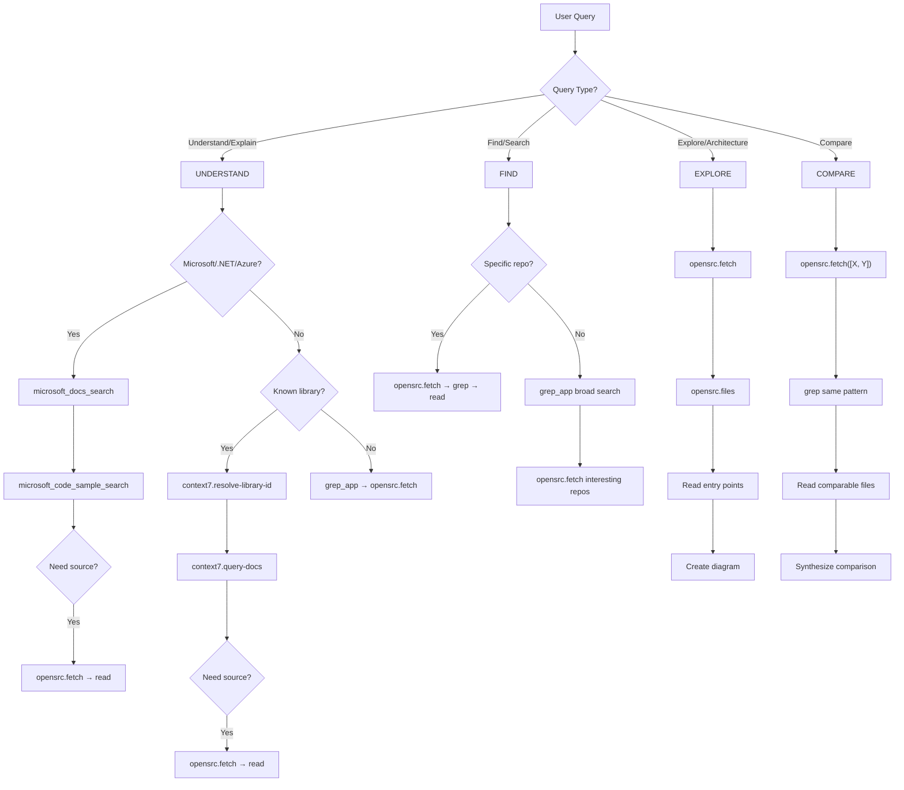

# Tool Routing

## Decision Flowchart



## Query Type Detection

| Keywords                                                | Query Type | Start With       |
| ------------------------------------------------------- | ---------- | ---------------- |
| "how does", "why does", "explain", "purpose of"         | UNDERSTAND | context7 or MS Learn |
| "find", "where is", "implementations of", "examples of" | FIND       | grep_app         |
| "explore", "walk through", "architecture", "structure"  | EXPLORE    | opensrc          |
| "compare", "vs", "difference between"                   | COMPARE    | opensrc          |

## Microsoft Technology Detection

| Keywords | Route to Microsoft Learn |
|---|---|
| Azure, .NET, C#, ASP.NET, Blazor, MAUI | Always |
| Entity Framework, EF Core, SQL Server | Always |
| Active Directory, Entra, Graph API | Always |
| NuGet, dotnet CLI, MSBuild | Always |
| Visual Studio (not VS Code) | Always |

**Workflow:** `microsoft_docs_search` for breadth → `microsoft_code_sample_search` for examples → `microsoft_docs_fetch` for depth on specific pages. Use these in parallel with opensrc/grep_app when you need both docs and source code.

## UNDERSTAND Queries

```
Microsoft tech?   → microsoft_docs_search → microsoft_code_sample_search
                    └─ Need source? → opensrc.fetch → read

Known library?    → context7.resolve-library-id → context7.query-docs
                    └─ Need source? → opensrc.fetch → read

Unknown?          → grep_app search → opensrc.fetch top result → read
```

**When to transition context7 → opensrc:**

- Need implementation details (not just API docs)
- Question about internals/private methods
- Tracing code flow through library

**When to transition MS Learn → opensrc/grep_app:**

- Official docs don't cover the internal implementation
- Need to see how others solve the problem in practice
- Tracing behavior through Microsoft's open source repos (e.g., dotnet/runtime)

## FIND Queries

```
Specific repo? → opensrc.fetch → opensrc.grep → read matches

Broad search?  → grep_app → analyze → opensrc.fetch interesting repos
```

**grep_app query tips:**

- Use literal code patterns: `useState(` not "react hooks"
- Filter by language: `language: ["TypeScript"]`
- Narrow by repo: `repo: "vercel/"` for org

## EXPLORE Queries

```
1. opensrc.fetch(target)
2. opensrc.files → understand structure
3. Identify entry points: README, package.json, src/index.*
4. Read entry → internals
5. Create architecture diagram
```

## COMPARE Queries

```
1. opensrc.fetch([X, Y])
2. Extract source.name from each result
3. opensrc.grep same pattern in both
4. Read comparable files
5. Synthesize → comparison table
```

## Tool Capabilities

| Tool                | Best For                                          | Not For             |
| ------------------- | ------------------------------------------------- | ------------------- |
| **opensrc**         | Deep exploration, reading internals, tracing flow | Initial discovery   |
| **grep_app**        | Broad search, unknown scope, finding repos        | Semantic queries    |
| **context7**        | Library APIs, best practices, common patterns     | Library internals   |
| **Microsoft Learn** | Azure/.NET docs, official examples, config        | Non-Microsoft tech  |
| **WebSearch**       | Discussions, blog posts, changelogs               | Source code         |
| **WebFetch**        | Raw files from GitHub, doc pages                  | Code search         |

## Anti-patterns

| Don't                               | Do                                      |
| ----------------------------------- | --------------------------------------- |
| grep_app for known library docs     | context7 first                          |
| opensrc.fetch before knowing target | grep_app to discover                    |
| Multiple small reads                | opensrc.readMany batch                  |
| Describe without linking            | Link every file ref                     |
| Text for complex relationships      | Mermaid diagram                         |
| Use tool names in responses         | "I'll search..." not "I'll use opensrc" |
| Answer from memory for Azure/.NET   | Microsoft Learn MCP first               |
